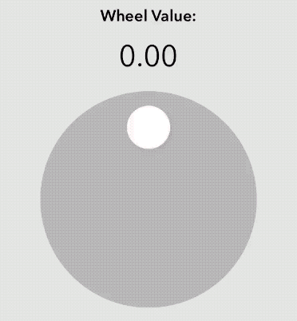
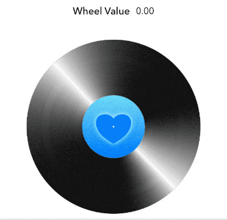

# KoiWheel

[](https://travis-ci.org/kwabford/KoiWheel)
[](https://cocoapods.org/pods/KoiWheel)
[](https://cocoapods.org/pods/KoiWheel)
[](https://cocoapods.org/pods/KoiWheel)

A customizable subclass of UIControl which allows you to create a Jog Wheel, Turntable or Knob.

## Preview


Updating the Wheel's Tint Color based on its value.




Custom Wheel image, Custom Overlay Image and an Angular Resistance set to 0.0.
## Usage
Drag and drop an `UIView` object into your view controller and set its class and module to `KoiWheel`.

## Supported Properties
| Properties        | Description      | Default value  |
| ------------- |-------------| -----|
| Value      | The Value of the Wheel. The number of revolutions from initial position.     | 0.0 |
| Minimum Value      | The Smallest Value of the Wheel.     | 0.0 |
| Maximum Value      | The Largest Value of the Wheel.     | 100.0 |
| Angular Resistance      | The greater the value the faster rotation slows to a stop.     | 1.0 |
| Marker Color      | The color of the Orientation Marker. The marker is only visible if Knob Image is `nil`.     | `white` |
| Knob Image      | An image for custom designing the wheel. Setting this to a non-nil value hides default Orientation Marker.     | `nil` |
| Knob Overlay Image      | A non-rotating decoration image for custom designing the wheel (eg. the glare on a record).      | `nil` |
| Overlay Alpha      | The alpha of the overlay image.     | 1.0 |


## Example

To run the example project, clone the repo, and run `pod install` from the Example directory first.

## Installation

KoiWheel is available through [CocoaPods](https://cocoapods.org). To install
it, simply add the following line to your Podfile:

```ruby
pod 'KoiWheel'
```

## Author

Kwab Fordjour
- [LinkedIn](https://www.linkedin.com/in/kwab-fordjour-b872b229/)
- [Twitter](https://twitter.com/kwabford)

## License

KoiWheel is available under the MIT license. See the LICENSE file for more info.
